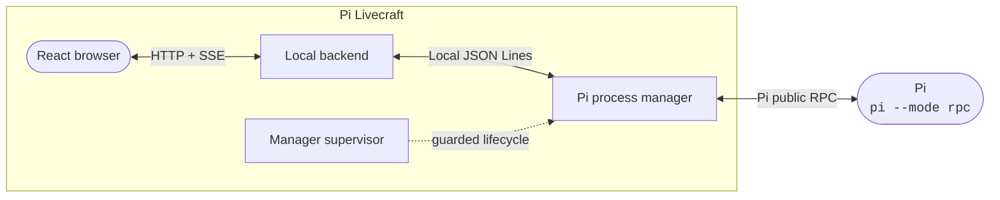

<div align="center">

#  ⤿ Pi Livecraft ⤾

**Pi does the agentic stuff. Livecraft gives it a live editable React app.**

The repository is set up to be forked and changed while you use it. 

[](https://pi.dev)
[](https://github.com/sebastienservouze/pi-livecraft/stargazers)
[](https://github.com/sebastienservouze/pi-livecraft/forks)
[](LICENSE)

[Why Livecraft?](#why-livecraft) · [Quick start](#quick-start) · [What is included](#what-is-already-in-the-box) · [Make it yours](#make-it-yours) · [Docs](/docs/README.md)

</div>

<p align="center"></p>
<p align="center"><sub>Just a silly example of live app modification</sub></p>

## Pi still does the work

Pi owns the providers, models, sessions, history, tools, commands, and extensions. It reasons, writes code, and runs tools.

Livecraft sits on top of it.

> Whatever Pi can send, Livecraft can receive. Whatever Pi can read, Livecraft can send.

You configure Pi as usual. Livecraft just calls it instead of keeping a second provider or model configuration.

## Why Livecraft?

**Pi already provides an exceptional experience in the terminal, no doubt about it.**

Sadly, a terminal can't (yet) do it all. A browser is handy for the parts that benefit from space and interactivity: graphs, small buttons, and advanced interactions (images, videos, 3D?).

For example, I embedded a **Session Analysis widget** that lets you monitor usage, token consumption, and cost in real time, as well as identify the costliest tool calls based on multiple criteria.

> "But I can do that in the terminal"

Yeah, you sure can! Now what about representing **all that data in a graph** and clicking on any point to **jump back to the corresponding turn or tool call** in the conversation so you can analyze it further?

> "Technically I can still do that in a terminal"

What about displaying fully interactive HTML pages directly in the tool result block? SVGs? Rendered Markdown? What about spawning confetti when a task ends?

> "Meh"

*Well, maybe Livecraft isn't for you then :3*

**The whole point is that** the UI lives in this repository and is hot-reloaded by Vite while all Pi sessions stay alive, so the model can change it **while** you use it. When something in the interface is annoying, the usual loop is:

1. Ask the model to change it
2. Watch it happen live
3. Use it from now on

All documentation in the project (except this README) is primarily meant to be read by agents (you can still read it, dw). Start with the [documentation index](/docs/README.md).

## Quick start

You need **Node.js 24+**, **npm**, and a configured **Pi**. Linux and WSL are supported. Native Windows 10/11 support is experimental and requires a Bash installation for Pi; Git for Windows is the simplest option.

**[Fork the repository](https://github.com/sebastienservouze/pi-livecraft/fork)**, then run:

```bash
git clone https://github.com/YOUR-USERNAME/YOUR-REPOSITORY.git
cd YOUR-REPOSITORY

npm install
npm run dev # this allows hot reloading
```

Open [http://127.0.0.1:5173](http://127.0.0.1:5173) and you should see Livecraft.

## What is already in the box

> Everything was designed to be easily navigable, extensible, and craftable by an AI agent, so you can try ideas quickly, just like with Pi!

> These are systems already present that you can build on top of or completely replace. You can also build totally new ones. Once the fork is done, it's **YOUR Livecraft**

### Work with Pi

- **Workspaces and parallel sessions:** create, switch, reopen, and monitor Pi sessions across several workspaces. Running and newly completed sessions remain visible in the list wherever you are

- **A Pi-native composer:** send text and images, use slash commands, stop a request, choose the models, thinking levels, and saved prompts exposed by Pi, and steer or queue follow-ups while Pi is working

- **Isolated prompts:** run a one-off Pi prompt from a widget, command, or anywhere really. By default it uses the cheapest available model in your Pi installation, returns one answer, and does not add anything to the active conversation

- **Extension dialogs:** handle Pi's standard select, confirm, input, and editor requests, plus structured questionnaires from Livecraft extensions

- **Livecraft-specific Pi extensions:** craft extensions meant to be loaded into Pi only when working with Livecraft, to improve your Livecraft's UX/UI.

### See what Pi is doing

- **Live conversations:** responses, activity, tool execution, usage, costs, errors, updates, notifications... I mean, everything Pi sends, Livecraft sees

- **Enhanced tool call rendering:** allow for complex (or simpler) tool call rendering. As an example, HTML, SVG, and Markdown will render directly, with the source still available and colorized with just a click

- **Contextual chat message actions:** build buttons on any tool call or session message. One example is the embedded copy input/output action available on all messages and tool call results

### Keep workspace tools nearby

- **Session analysis:** real-time usage analysis of the session. All the data is shown as interactive graphs. Click any point to jump back to the corresponding turn or tool call in the session. This one is a very good example of the potential here!

- **Todos:** add tasks before you forget them while the session is running. Morph these todos into real sessions with a single click. They are persisted per workspace (I used this feature heavily while developing Livecraft)

- **Git:** review status, diffs, changed files, and unpushed commits; commit, push, reset, or revert without leaving the conversation

- **Provider quotas:** see OpenAI Codex and GitHub Copilot usage windows in one panel (I only use these, ahah. Feel free to add your provider.)

- **Terminal:** open an external Linux, WSL, or Windows terminal in the current workspace from the rail, palette, or a shortcut

### Shape the workbench

- **Editable color themes:** start from Light or Dark, or build from either one. An agent can do it, but save your tokens and edit the theme manually. Choose a base theme, then an accent and a secondary color; everything will be derived from them. You now have your theme

- **Command palette and editable shortcuts:** commands share one registry. Sidebar widgets get their commands automatically. Use `Alt+K` to show the command palette

- **Local preferences:** conversation display, workspace restoration, shortcuts, terminal command, panel sizes, and widget state stay in the browser

- **Flexible layout:** don't like the side panels? **** them; you can do whatever you want

- **Notifications:** routine notices disappear on their own and errors remain until dismissed

## Make it yours

Pi Livecraft's repository is a starting point. **Forks are expected to drift away from upstream**, and there is no requirement to keep them synchronized.

> In fact, DO update the core and do your thing. Upstream won't change except for small bug fixes. No more features!

Use it for a while. When something gets in the way, ask the model to change it and keep the result if it helps :)

Some reasonable first changes to test it:

- turn a repeated prompt or workspace command into a one-click action;
- give an important Pi tool a presentation that matches its output;
- add a right-rail widget for context you repeatedly hunt down;
- combine messages, forms, and actions into a recurring workflow;
- remove every feature you do not use;
- **add something objectively unnecessary but personally delightful**

Upstream stays conservative and mostly takes bug fixes. New workflows and product choices should live in the forks that need them.

## Where to start changing things

The list above shows what exists. The guides below show where a change belongs and which focused check covers it.

| You want to... | Start here |
| --- | --- |
| Change the composer | [Composer guide](/docs/HOW-TO-COMPOSER.md) |
| Add an action to a message or tool call | [Conversation action guide](/docs/HOW-TO-CONVERSATION-ACTION.md) |
| Give a Pi tool a custom presentation | [Tool presentation guide](/docs/HOW-TO-TOOL-PRESENTATION.md) |
| Add a palette command or shortcut | [Palette command guide](/docs/HOW-TO-PALETTE-COMMAND.md) |
| Add a setting or theme | [Settings guide](/docs/HOW-TO-SETTINGS.md) and [theme guide](/docs/HOW-TO-THEME.md) |
| Add a sidebar widget | [Widget guide](/docs/HOW-TO-WIDGET.md) and [widget contracts](/src/features/right-sidebar/README.md) |
| Present UI from a Pi extension | [Dialog contract](/src/features/dialogs/README.md) and [Pi extensions](/pi-extensions/README.md) |
| Send another command to Pi | [Pi RPC guide](/docs/HOW-TO-TALK-TO-PI.md) |
| Run a prompt without touching the session | [Isolated prompt guide](/docs/HOW-TO-RUN-ISOLATED-PROMPT.md) |
| Understand how the browser, local services, and Pi connect | [Architecture guide](/docs/ARCHITECTURE.md) |

The [documentation index](/docs/README.md) links the feature contracts, backend capabilities, widgets, and focused checks behind each surface.

## For my technical folks, briefly

Everything runs locally!

The browser renders the application. A local backend handles Livecraft features and carries Pi's events back to the page.

A **separate manager starts and owns the Pi processes**, so refreshing the browser or restarting the backend does not close them, because the manager lives outside the Vite hot reload domain.



Vite can update the frontend while a session stays open. The backend can also restart without closing active Pi processes.

If manager code changes, Livecraft shows a persistent notice and waits. The manager is not replaced until you ask and Pi is idle. Sessions closed during the replacement remain available in history. That's the trick. Cool, right? :)

The manager talks to Pi through its public RPC protocol. Livecraft extensions use Pi's public extension API so you're in good hands.

Git, todos, terminal launching, and browser preferences remain local Livecraft features. There is no Livecraft extension system, so you can break it all!

> Read the [architecture guide](/docs/ARCHITECTURE.md) for the full flow. Read the [manager lifecycle guide](/docs/MANAGER-LIFECYCLE.md) if you want to mess with the manager's process supervision.

## Optional Pi extras

When these extensions are installed and configured in Pi, Livecraft already contains the logic and UI for them, since they are the apples to my Pi (holy...)

- **[@nerisma/pi-agents](https://github.com/sebastienservouze/pi-agents):** adds specialized agents with focused prompts, restricted tool sets, and isolated delegation. When Pi exposes `/agent`, Livecraft displays an agent picker.
- **[@nerisma/pi-auto-title](https://github.com/sebastienservouze/pi-auto-title):** names sessions from their first prompt, which makes parallel histories much easier to scan.

> Just to be clear, these are NOT mandatory. Pi Livecraft can work with anything; these are just my preferences, and they work by default :)

<details>
<summary><strong>Troubleshooting</strong></summary>

- `pi: command not found`: install Pi globally and verify that `pi --version` works in the shell used to start Livecraft.
- The manager or backend is unavailable: check ports `43120` and `43121`, or set `PI_LIVECRAFT_MANAGER_PORT` and `PI_LIVECRAFT_BACKEND_PORT`. After a manager crash, restart `npm run dev`; the supervisor intentionally does not relaunch it automatically.
- A new session cannot answer: launch Pi once, configure a provider with `/login`, and verify that the `/agent` extension is available if your setup expects it.
- Linux desktop actions unavailable: install or expose `xdg-open` and `x-terminal-emulator` in `PATH`.
- WSL desktop actions unavailable: verify that `explorer.exe`, `wslpath`, and `wt.exe` are available in the WSL `PATH`.
- Windows cannot start Pi: verify that the npm `pi.ps1` shim is in `PATH`. Pi also needs Bash; it detects Git Bash automatically, or accepts `shellPath` in `~/.pi/agent/settings.json`.
- Windows terminal unavailable: install Windows Terminal for `wt.exe`, or verify that the built-in `powershell.exe` fallback is in `PATH`.

</details>

<details>
<summary><strong>Development checks</strong></summary>

Run the narrowest check that covers your change. For a larger change, the full local set is:

```bash
npm run typecheck
npm run lint
npm test
npm run build
```

The Pi RPC integration test additionally requires a configured Pi installation.

</details>

## Built with Pi, for Pi ❤️

Pi provides the agent runtime, sessions, tools, and extension model. It does the actual work; Livecraft is a local web interface built around it.

## Contributing

Focused bug reports and bug fixes are welcome upstream. Workflow features belong in the forks that need them. Do your thing!

## License

Pi Livecraft is available under the [MIT License](/LICENSE).
